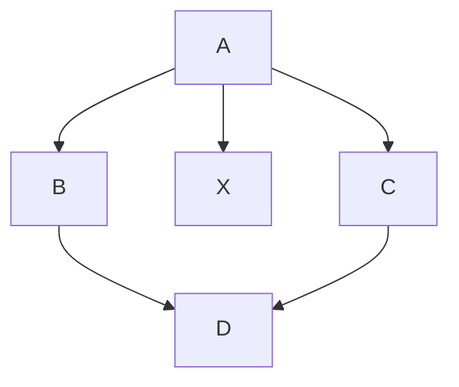
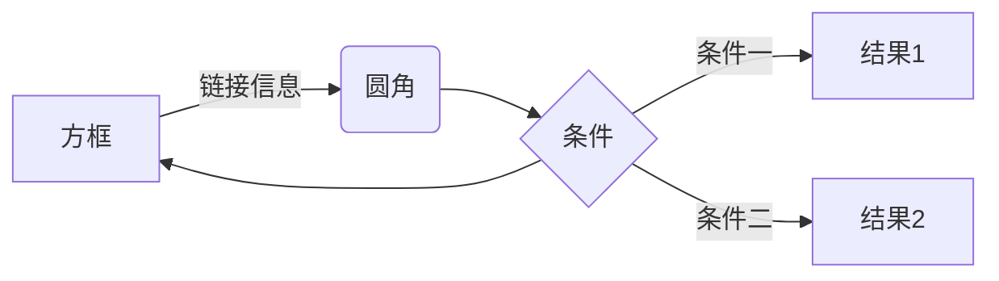

# 记录

1. at_ba 改为common
2. adminstrator 使用json，可以多笔连接在一起
3. spm-A01

查询,申请表单的查询

## 记录

retro因为和大家讨论很清晰，如果是自己的反省的话，怎么做到这么清晰

#### **未经验证就交由 PO 测试**

给别人写测试用例，只有都通过，才能发布测试

自测、TL测、PO测

#### 没有做预先的调研和设计

复杂的没有原型，就不做

简单的，可以直接开发

#### 任务牵涉广，复杂度高

画流程图的SOP，解复杂度
