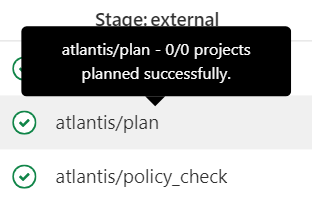

* [ ] **VSCode Essentials**

### 分组并转为map

```java
Map<String, Integer> whqPscSdbBrandSystemSyncVoMap = systemSyncVos.stream()
        .collect(Collectors.groupingBy(
                WhqPscSdbBrandSystemSyncVo::getBrand,
                Collectors.collectingAndThen(
                        Collectors.maxBy(Comparator.comparing(WhqPscSdbBrandSystemSyncVo::getSeqnoSap)),
                        optionalVo -> optionalVo.map(WhqPscSdbBrandSystemSyncVo::getSeqnoSap).orElse(null)
                )
        ));

```

### Grafana如何设置默认时间范围

切换时间范围，再保存dashboard，有选项提示你要不要修改默认的时间范围

### 下载远程DB的文件，无法连接到远程服务器

不管是使用ftp/sftp，或者是连接远程服务器全部失败

最后直接用本地DBeaver，连接远程DB，IHKMDBP01.wih.wistron\TWHSZKMDBSQL2K8	1433

### pg grant permission

```pgsql
GRANT ALL ON SCHEMA public TO pscq;
GRANT ALL ON ALL TABLES IN SCHEMA public TO pscq;
--GRANT ALL ON TABLE sdb.whq_psc_sdb_customer to pscq;
grant USAGE, SELECT on all sequences in schema public to pscq ;
```

### plan 失败的时候应该怎么办

[feature:prd:AZRCorpAVTSDM:backup (!2380) · Merge requests · CCOE / ProvisionMgmt / atlantis-prd · GitLab (wistron.com)](https://gitlab.wistron.com/ccoe/provisionmgmt/atlantis-prd/-/merge_requests/2380)

修改文件，重新push，这样就会再次plan

### 如何修改atlantis prd已存在的配置

[MR1](https://gitlab.wistron.com/ccoe/provisionmgmt/atlantis-prd/-/merge_requests/2376/pipelines)

1. 注释terragrunt（删除）
2. 如果遇到lock，需要申请删除lock（删除lock）
3. apply（应用变更）
4. 提交mr（合并代码）

[MR 2](https://gitlab.wistron.com/ccoe/provisionmgmt/atlantis-prd/-/merge_requests/2377/pipelines)

1. 修改配置（关键改动）
2. 恢复terragrunt（新增变更）
3. apply（应用变更）
4. 建立一个文件夹，新增这个lock，再进行（恢复lock）
5. apply（应用变更）
6. 提交mr（合并代码）

先删除，再恢复，即是修改

atlantis跑pipeline，是判断你有没有新增目录或者注释terragrunt，是和mr之前进行的对比

如果和之前相比只是修改了其他部分的代码的话，会立刻跑完三个pipeline，但是没有对任何一个项目进行生效，其实是没检测到修改



再过程中，只需要下atlantis apply即可生效

ccoebot /merge操作，只是用来合并代码到master分支上

### blob storage默认规则允许公司内部网络访问的原因

1. **AllowVnetInBound（优先级65000****）** ：

* **协议** ：任意（All）
* **源** ：任意（Any）
* **目标** ：虚拟网络（VirtualNetwork）
* **访问** ：允许（Allow）
* 此规则是针对所有流量（所有协议），并且目标是虚拟网络（"VirtualNetwork"）。由于任何在同一虚拟网络中的计算机都可以被视为“公司内部网络”，因此该规则允许来自该虚拟网络内的所有流量访问Blob Storage。
* **10开头的网段** ：如果您的虚拟网络的IP地址段中包含10.x.x.x的网段，那么所有在该网段内的设备（如虚拟机、应用服务等）都能通过此规则访问Blob Storage，因为他们都是同一个虚拟网络中的成员，这条规则确保了该网段的流量被允许通过。

 **Azure VNet对等互连** ：

* 如果您的公司网络与Azure虚拟网络之间存在VNet对等互连，那么您可以从 `10.66.144.140` 访问 `10.20.102.96` 子网的资源。这种情况下，只要有合适的路由和权限，您就能成功访问

`10.20.17.0/24`：这是目标虚拟网络的地址空间。

可以使两个或多个虚拟网络互相传递流量，从而实现资源之间的直接通信。即使这些虚拟网络位于不同的Azure区域，您仍然可以通过对等互连互相访问。
