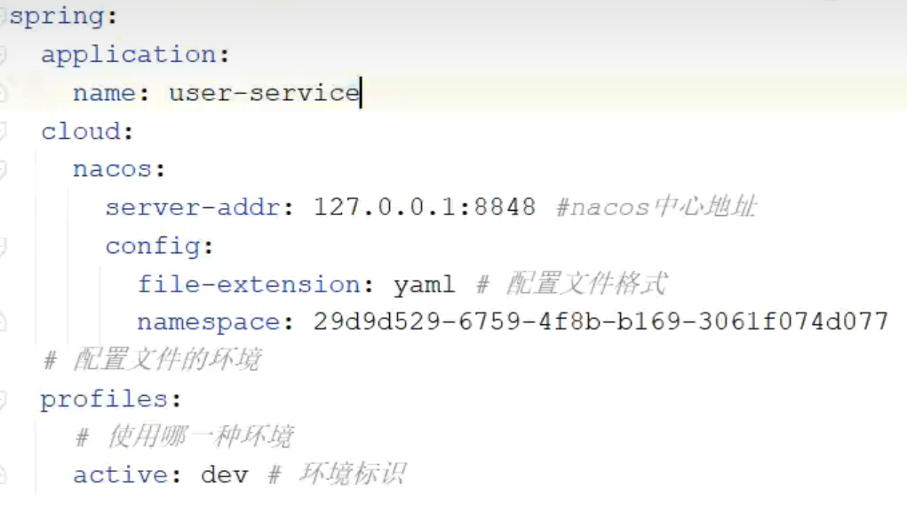
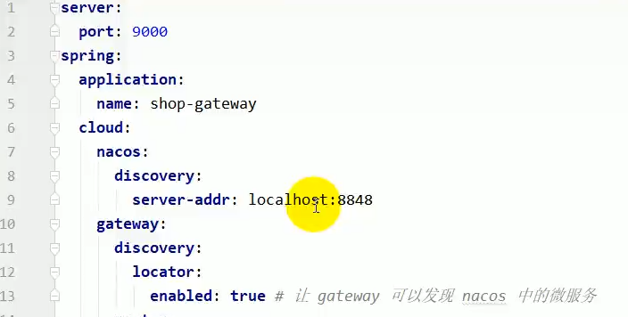
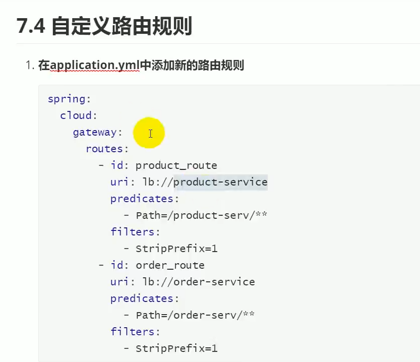
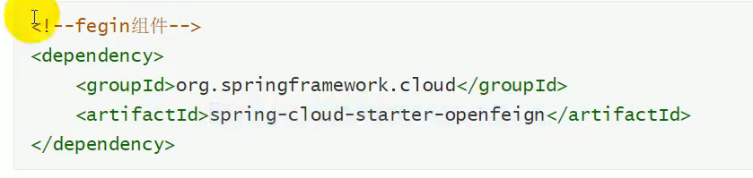
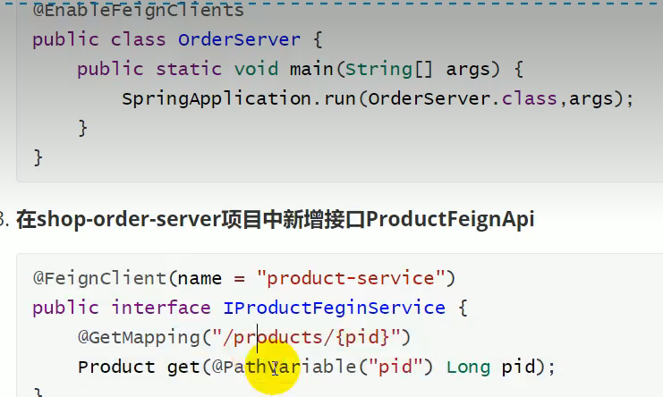

## nacos 

### pom文件添加依赖

```yaml

```

### app中加上

```
@EnableDiscoveryClient
public class TripGateWayApplication {
```

### yml文件中加上

```json
server:
  port: 9999
spring:
  application:
    name: trip-gateway
  cloud:
    nacos:
      discovery: # 服务注册中心地址
        server-addr: 127.0.0.1:8848
```

## nacos config

配置中心

1. 统一管理配置
2. 必须重启微服务才能生效




## gateway

applicaiton yml



自定义路由转发



id：唯一

uri：匹配规则后，请求的路径，lb（load balance）+服务名称

predicates：数组类型：断言url是否匹配规则，成功的话转发到uri上去

filters：strip去除前缀，再转发给uri，比如order-serv/orders/1变成orders/1

## feign

声明式的伪http客户端，只需创建接口添加注解

feign默认继承了ribben，负载均衡

### 服务调用者方增加






