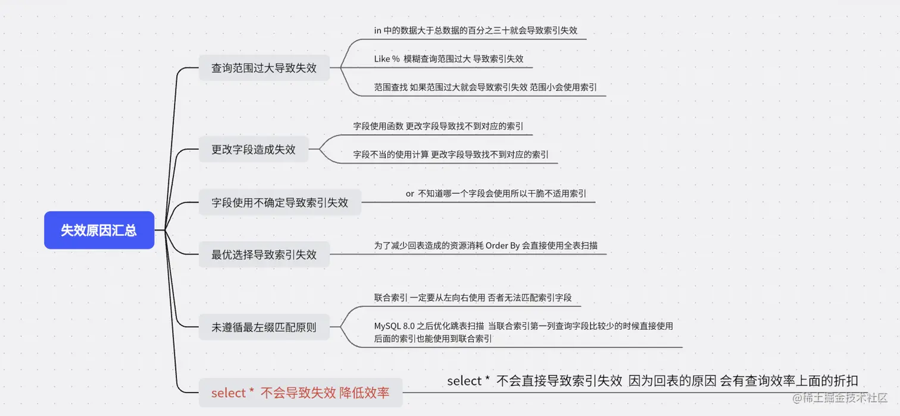

### DB engine

innoDB支持行锁、表锁

#### 表锁

对非索引字段加锁，对当前操作的整张表加锁

加锁快，不会发生死锁，但是锁冲突概率高

#### 行锁

针对索引字段加锁

颗粒度更小，可以对一行或者多行记录上锁

### 三种行锁方式

1. 记录锁：单个行记录的锁
2. 间隙锁：一个范围的锁，不包含记录本身
3. 临键锁： 锁定一个范围，包含记录本身，解决幻读的问题（新增插入）

innodb默认使用next-key lock，如果索引是唯一索引或者是主键，会降级成record lock

### 并发DB带来的问题

#### 脏读

事务修改对其他事务是可见的，即使没提交

如果这个事务回滚的话，其他的事务读到的就是脏数据

#### 丢失修改

两个事务读取同一数据，分别进行修改，导致最后一个生效

#### 不可重复读

一个事务内第二次读取之前，被其他事务修改，导致两次读取不一致

#### 幻读

记录新增，类似不可重复读

### Mysql的并发事务控制方式

#### 读写锁

读锁（共享锁，S）可以并行，写锁是排他锁)

#### MVCC

### 事务隔离级别

#### READ_UNCOMMITED（读取未提交）

允许读取没提交的，可能导致脏读、幻读、不可重复读

#### READ_COMMITTED（读取已提交）

只允许读取已经提交的，解决脏读

#### REPEATABLE_READ（重复读）（innodb默认）

对同一字段的多次读取结果一致，除非自己修改了， 解决脏读、不可重复读

#### SERIALIZABLE（可串行化）

一条一条执行，影响效率

### SQL性能优化

1. 慢sql定位和分析
   1. explain命令：分析查询计划、索引使用情况、全表扫描等
   2. **监控工具**：慢查询日志、performance schema
2. 索引、表结构和sql优化
   1. 创建索引、覆盖索引、最左前缀匹配原则
   2. 表结构设计
   3. 使用具体字段、连接查询代替子查询、合理使用分页查询、批量操作等
3. 架构优化
   1. 读写分离：读和写分离到不同的数据库实例，提升并发能力
   2. 分库分表：降低单表的数据量，减少压力，但是复杂性会升高
   3. 冷热分离：根据访问频率和重要性，冷数据放在低成本的机器上，热数据放在高性能上
   4. 缓存机制：性价比最高，使用redis等缓存中间件，将热点数据缓存到内存中，减轻数据库压力
4. 其他优化
   1. 连接池配置：连接池大小、超时时间
   2. 硬件升级：增加内存

### index索引

#### 最左前缀匹配原则

如果sql语句用到了联合索引的最左边的索引，就可以使用这个联合索引去进行匹配

最左边的连续的索引，都能匹配上，优化器会自动调整位置；如果是范围查询（>、<、between、like），就不连续，停止匹配

例子：联合索引是（`sname`, `s_code`, `address`）

**成功例子**

```pgsql
where sname="变成派大星"
where address="上海" and sname="变成派大星"
```

**失败例子**

```pgsql
where address = "上海" and s_code = 1; 相当于* 1 1，第一个字段匹配到所有的值
where sname = "变成派大星" and s_code > 1 and address = "上海"  （这个查询type是range不是ref（非唯一性索引扫描））
```

#### 跳越扫描

如果第一个索引唯一值比较少，第二个索引也可以使用联合索引

#### 索引的底层原理

B+树，由于构建B+树只能根据一个值来确定索引关系，所以用最左的字段

先排序最左字段、在排序剩下的字段

所以不建议建立在经常变动的字段上，否则索引结构也要跟着改变

#### 不推荐使用select *

1. 无用字段增加网络消耗
2. 多了一次B+树查询，速度慢很多。通过主键索引过滤数据，再通过主键ID去全表获取所有的列，术语是回表

#### 索引失效情形

##### Like%

如果范围比较小，xxx%(0或者多个字符) 、xxx_（1个字符）的话，可能会走索引

##### Or

需要全部加上索引

##### in、not in

在结果集大于30%失效

##### orderby

全表扫描， 而不使用索引




#### 回表问题

回表查询在非主键索引上，导致两次树查询的问题
