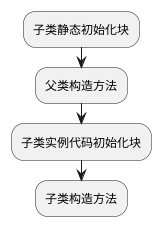

## 基础

### 访问权限

1. private，实例可见
2. protected，继承实例可见
3. default，包可见
4. public，所有可见

子类的访问权限需要高于父类，满足了里氏替换原则


### 代码初始化块

编译器将代码初始化块放在构造方法的最前面执行

子类构造方法会调用父类的构造方法



静态代码初始化块，在类加载的时候执行，一次

### 抽象类

抽象类不能被实例化

有抽象方法的类一定是抽象类，但是抽象类里可以没有抽象方法，都是具体方法

如果继承了抽象类，一定要具体实现抽象方法，否则子类还是抽象类

## 内存模型

## 并发

### 1. 可见性

* 原理：一个线程对变量的修改，另一个线程可以立刻看到
* 影响：CPU缓存导致没有及时更新到主存中
* 解决：volatile保证修改的变量会立即更新到主存，其他线程需要访问这个变量，会去主存中读取新的值

PS：synchronized和Lock保证单线程执行，也可以解决这个问题

### 2. 原子性

* 原理：要么全部执行，要么不执行
* 影响：分时复用
* 解决：synchronized和Lock保ss证单线程执行，就不存在原子性的问题

### 3. 有序性

* 原理：按照顺序
* 影响：指令重排
* 解决：synchronized和Lock保证单线程执行，相当于是顺序执行

### happens-before规则

* 线程安全，保证对这个对象的操作是，在调用的时候不需要做额外的保障措施
  * 比如：HashTable、Vector
* 线成不安全（线程对立），可以使用同步手段在并发环境中安全的使用
  * 比如：HashMap、ArrayList

#### 互斥同步

synchronized和ReentrantLock

jvm实现和JDK实现

#### 非阻塞同步

乐观锁，先进行操作，如果没有其他线程争用共享数据，那么就操作成功了，否则就不断重试，直到成功为止

原子操作：CAS，比较并交换，地址V，旧的预期值A和新的值B，如果V的值等于A的话，才更新为B

```java
public final int getAndAddInt(Object var1, long var2, int var4) { // var1地址，var2地址的偏移，操作加的值
    int var5;
    do {
        var5 = this.getIntVolatile(var1, var2); // 获取旧的预期值
    } while(!this.compareAndSwapInt(var1, var2, var5, var5 + var4)); // 不断重复CAS操作，直到内存地址的值等于旧的预期值，就进行更新

    return var5;
}
```

#### 无同步方案

1. 栈封闭，使用的是局部变量
2. 线程本地存储，每个线程里面都有自己的ThreadLocal Map对象，可以存多个不同的ThreadLocal对象
3. 可重入代码，纯代码，可以随时中断，之后再来继续执行

### 线程状态转换

1. new：新建但未启动
2. runnable：正在运行或者等待CPU时间片
3. block：阻塞，等待获取排他锁，如果获取到了，就会结束此状态
4. time waiting：限时等待，
   1. Tread.sleep(millisec) || 等待时间结束
   2. Object.wait 有timeout参数 || 等待时间结束/Object.notify/notifyAll
   3. Tread.join 有时间参数 || 时间结束/等待加入的线程结束
   4. LockSupport.parkNanos/parkUntil
5. waiting：无限期等待。等待显式的唤醒
   1. Object.wait
   2. Tread.join || 等待被调用的线程执行完毕
   3. LockSupport.park
6. terminated：线程结束或者有异常而结束

### Executor

1. CachedThreadPool：每个异步任务创建一个线程
2. FixedThreadPool：固定大小的线程池
3. SingleThreadExecutor：相当于大小为1的FixedThreadPool

### 互斥同步

#### synchronized

1. 同步一个对象：不同实例之间互不影响
2. 同步一个方法，同上
3. 同步一个类：该类的不同对象的同步语句也会同步
4. 同步一个静态方法，同上

**join，将当前挂起，直到目标线程结束**

**wait 挂起线程，等待notify唤醒，再继续执行**

因为是JVM的Object方法，需要再synchronized里面使用

**await和signal signalAll**

是ReentrantLock的方法，可以指定等待的条件，更加灵活

#### 字节码

monitorenter

每一个对象同一时间只和一个锁计数器相关联

1. 当锁计数器为0的时候，锁计数器+1
2. 已经获得了这个锁的所有权，又重入了这个锁，锁计数器会+1
3. 当锁计数器大于0的时候，等待获取锁

monitorexit

锁计数器-1，如果是0，释放锁；如果不是0，说明是重入的，依然保持所有权

#### 可重入锁（递归锁）

可重入锁，单个线程执行时重新进入同一个子程序

获取锁的时候进入其他的加锁的方法

### 锁优化

互斥锁需要将用户态切换到核心态，代价昂贵

可以使以下方式

1. 锁粗化：连续的锁扩展成一个锁
2. 锁消除：消除没有在当前同步块以外被其他线程共享的变量的锁
3. 轻量级锁：无竞争线程中，重量级锁改为CAS操作；竞争的环境中，失败的CAS操作会转为重量级互斥锁
4. 偏向锁：无竞争线程中，避免CAS操作
5. 适应性自旋：尝试获取轻量级锁过程中执行CAS操作失败后，会进入一定次数的忙等待再尝试，依然没有成功，会调用互斥锁，进入阻塞状态

无锁 - 偏向锁 - 轻量级锁 - 重型锁

#### 锁消除

不存在共享数据竞争的锁进行消除，判定依据是逃逸检测

#### 自旋锁

挂起和释放锁都需要到内核态中才能执行，还阻碍了其他的线程，极大影响了效率。

而且锁定只是很短的时间，所以让门外的线程忙等待（自旋）一会

如果锁定时间比较长，会白白占用CPU的时间

默认自旋次数为10

适应性自旋，由前一次同一个锁的自旋时间和锁拥有者的状态决定，如果刚刚自旋获取到锁，并且锁所有者正在执行中，有大概率获得锁，会自动增加等待时间；如果获得锁的概率比较低，会省略掉自旋，避免浪费CPU资源。

#### 锁粗化

同步块的作用范围尽可能小，使得操作数尽可能少，等待时间尽可能少

但是频繁的上锁和解锁也会影响性能
