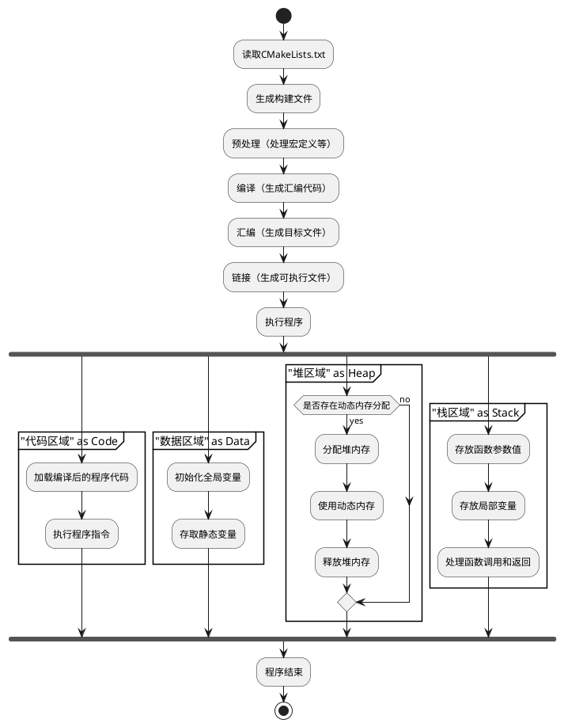
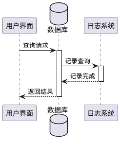

## 流程图

```plantuml
@startuml
skinparam monochrome false
skinparam shadowing false
start
:读取CMakeLists.txt;
:生成构建文件;
:预处理（处理宏定义等）;
:编译（生成汇编代码）;
:汇编（生成目标文件）;
:链接（生成可执行文件）;
:执行程序;
fork
  partition "代码区域" as Code {
    :加载编译后的程序代码;
    :执行程序指令;
  }
fork again
  partition "数据区域" as Data {
    :初始化全局变量;
    :存取静态变量;
  }
fork again
  partition "堆区域" as Heap {
    if (是否存在动态内存分配) then (yes)
      :分配堆内存;
      :使用动态内存;
      :释放堆内存;
    else (no)
    endif
  }
fork again
  partition "栈区域" as Stack {
    :存放函数参数值;
    :存放局部变量;
    :处理函数调用和返回;
  }
end fork
:程序结束;
stop
skinparam partitionBackgroundColor<<Code>> LightBlue
skinparam partitionBackgroundColor<<Data>> LightGreen
skinparam partitionBackgroundColor<<Heap>> LightCoral
skinparam partitionBackgroundColor<<Stack>> LightGoldenRodYellow
@enduml
```

## 时序图

```plantuml
	@startuml
participant "用户界面" as UI
database "数据库" as DB
participant "日志系统" as Logger
UI -> DB : 查询请求
activate DB
DB -> Logger : 记录查询
activate Logger
Logger --> DB : 记录完成
deactivate Logger
DB --> UI : 返回结果
deactivate DB
@enduml
```

## 参考

[官方文档](https://plantuml.com/zh/activity-diagram-beta)

[在线使用](https://www.plantuml.com/)

[阿里使用文章](https://developer.aliyun.com/article/1469448)
