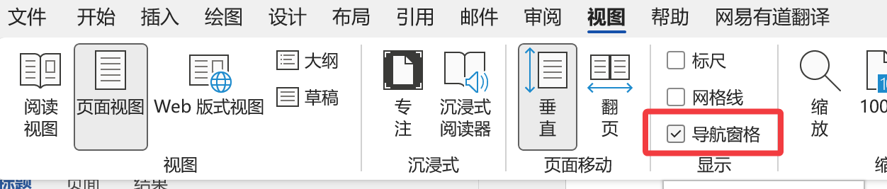
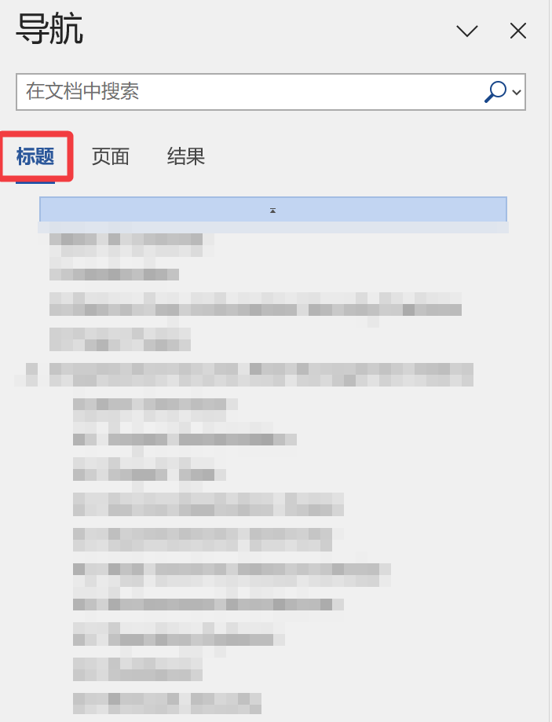

# Cheat Sheets

## VSCODE

找了很多的markdown工具，但是要么是vsc的模仿品，要么就是使用起来没有vsc方便的

最后决定还是使用vsc来写markdown

| 按键    | 功能                | 备注 |
| ------- | ------------------- | ---- |
| alt+1~5 | 切换到第1~5个编辑页 |      |
|         |                     |      |

## WORD

#### 如何打开左侧目录

点击视图，导航窗格

快捷键Ctrl F，点击标题，即可显示目录，并且可以跳转

## WINDOWS

打开启动文件夹

按下 `Win + R`，输入 `shell:startup` 确定
