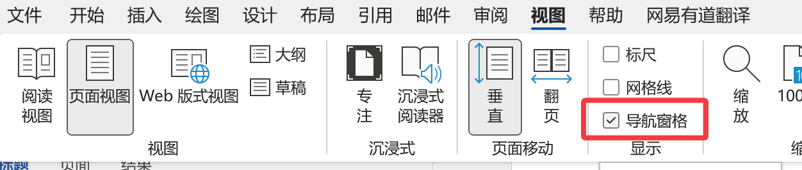
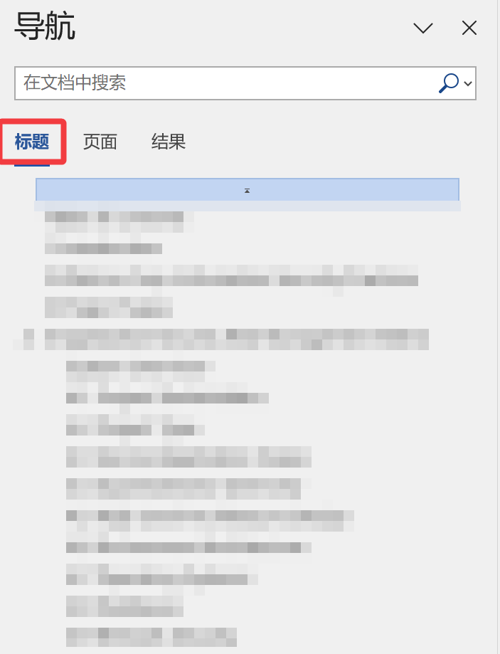

# Cheat Sheets

## cron

Cron表达式是用来配置定时任务执行时间的一种字符串格式，由6或7个字段组成（不同系统可能有差异），各字段以空格分隔。

```
秒 分 时 日 月 星期
```

### 各字段详解：

1. **秒** (0-59)
2. **分** (0-59)
3. **时** (0-23)
4. **日** (1-31)
5. **月** (1-12 或 JAN-DEC)
6. **星期** (1-7 或 SUN-SAT，注意1=周日/7=周六)
7. **年** (可选字段，你的配置中没有)

### 特殊字符：

* `*`：任意值
* `?`：不指定（仅用于日和星期字段互斥时）
* `-`：范围（如 `10-12`）
* `,`：多个值（如 `MON,WED,FRI`）
* `/`：步长（如 `0/5` 表示从0开始每5单位）
* `L`：最后一天（月份最后一天或周六）
* `W`：最近工作日
* `#`：第几个周几（如 `6#3` 表示第3个周五）

### 其他常见示例：

* `0 0 12 * * ?` → 每天中午12点
* `0 15 10 ? * MON-FRI` → 每周一到周五上午10:15
* `0 0/30 9-17 * * ?` → 每天9点到17点，每30分钟一次

## VSCODE

找了很多的markdown工具，但是要么是vsc的模仿品，要么就是使用起来没有vsc方便的

最后决定还是使用vsc来写markdown

| 按键    | 功能                | 备注 |
| ------- | ------------------- | ---- |
| alt+1~5 | 切换到第1~5个编辑页 |      |
|         |                     |      |

## WORD

#### 如何打开左侧目录

点击视图，导航窗格



快捷键Ctrl F，点击标题，即可显示目录，并且可以跳转



## WINDOWS

打开启动文件夹

按下 `Win + R`，输入 `shell:startup` 确定
