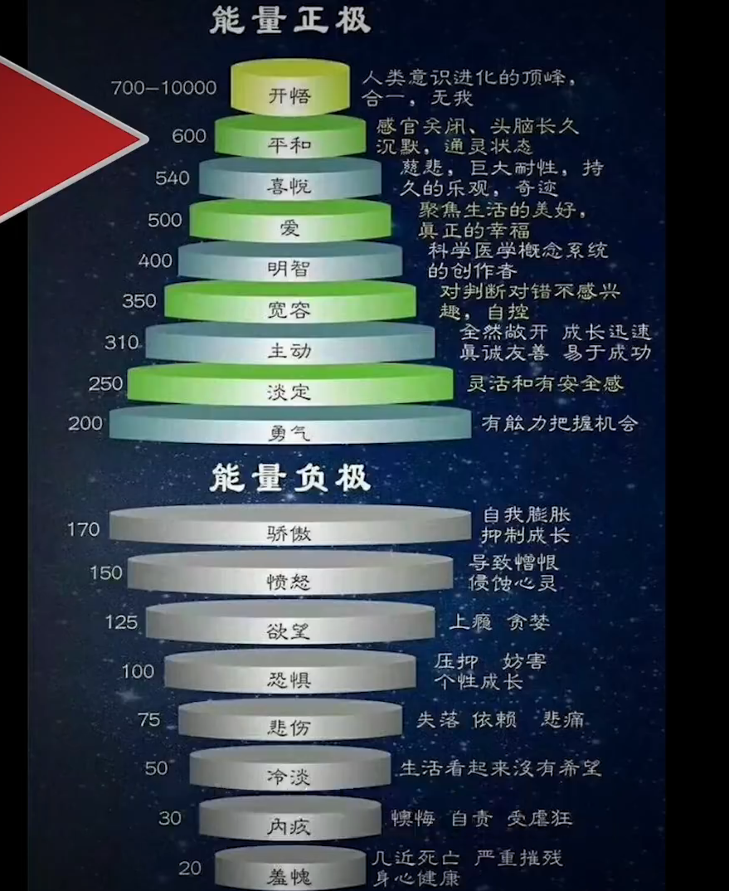
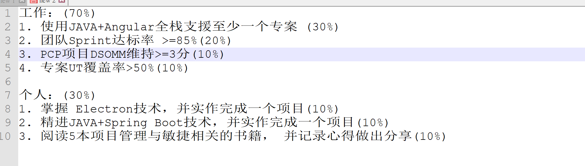
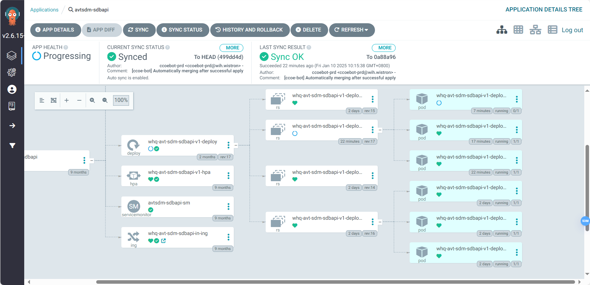

解决烦恼，解决没有意义的负面的反应

没有执着就没有痛苦，没有追求就没有烦恼

观察攀缘心，关注在风门

忏悔每天

#### 方便法门

1. 改过、行善
2. 准提咒，念到无杂念
3. 记录每一念，才动即觉，觉之即无。
   1. 往前推，为什么会产生这个念头
   2. 止不住就绵绵的停止观察，注意力放在呼吸上

写日记：

1. 手写、工整
2. 早上写
3. 记心，从早到晚的不符合圣人的言行举动
4. 有意思的事情
5. 100-200字
6. 给朋友传阅

### 方法：

1. 语言或者文字表达清楚自己的烦恼
2. 体会自己身体的感受
   1. 完美型
   2. 妄想型



### cicd 前端npm test的时候报错，找不到@ctrl/tinycolor

> ./node_modules/ng-zorro-antd/fesm2022/ng-zorro-antd-core-config.mjs:5:0-44 - Error: Module not found: Error: Can't resolve '@ctrl/tinycolor' in '/builds/avatar/avtsdm/ang/avtsdm_vcweb/node_modules/ng-zorro-antd/fesm2022'

安装即可解决问题

```
npm i @ctrl/tinycolor
```

### nothing

### 统计点数

在 Excel 中计算各开发人员的总“预估点数”和总“预估天数”，可以按照以下步骤操作：

1. **确保数据格式正确：** 确保“開發人員”、“預估點數”、“預估天數”列已准备好。
2. **插入数据透视表：**
   * **步骤 1：** 选中整个数据区域（包括表头）。
   * **步骤 2：** 点击“插入”菜单中的“数据透视表”按钮。
   * **步骤 3：** 在弹出的窗口中，选择需要放置数据透视表的位置。
3. **设置数据透视表字段：**
   * 将“開發人員”拖放到“行”区域。
   * 将“預估點數”拖放到“值”区域，并确保“值字段设置”为“求和”。
   * 将“預估天數”拖放到“值”区域，并确保“值字段设置”为“求和”。
4. **调整数据透视表格式：**
   * 确保每位开发人员对应的“预估点数”和“预估天数”已正确求和。

完成后，数据透视表将显示每位开发人员的总预估点数和总预估天数。

### 启用表格自动刷新

1. **将数据转换为表格**
   * 在原始数据区域，选择整个数据范围。
   * 按 `Ctrl + T` 或从**插入 > 表格**中创建表格，这样可以让透视表随着表格数据的变化自动更新。
2. **选中表格**后，在功能选项卡的右上角启用“表工具”的动态范围功能。

### rest template

### KPI相关

supplier center 持续roll out

DSOMM要满足那个持续持续维持在3分标准这样子，然后配合那个治安政策就是一样，要满足相关的那个。

支援專案：

1. 在PCP項目中，達到整個項目，每個sprint平均完成故事點數 >= 20;（45%）
2. 在PCP項目中，協助團隊將所屬API的測試覆蓋率提升到50%以上；（20%）
3. 在PCP項目中，協助團隊DSOMM維持>=3;

個人：

1. 讀一本技術架構相關書籍，分享心得；（10%）
2. 參與一次技術社區活動，分享心得；（10%）
3. TCM等級提升目標:  額外分擔部門一些額外任務；（15%）



### 发信api

sendNoSurveyMail

### pending表同步权限

[ssm api qas](https://psc-ssmapi-qas.wistron.com/swagger-ui/index.html)：SupplerGroupPermission

[ssm dev](https://whq-avt-sdm-psc-ssmapi-dev.southeastasia.azure.wistron.com/swagger-ui/index.html)

[processBrandApproval ](https://whq-avt-sdm-sdbapi-dev.southeastasia.azure.wistron.com/swagger-ui/index.html#/sap-eai-controller/processBrandApproval)

### 运行的时候依赖找不到

卸载node_module再重新安装

如果发现有权限不足的，删除哪个依赖，再pnpm i

### tss

PCP项目中

1. 完成處級簽核reject功能
2. 完成Summary Survey Result查詢功能
3. 完成Survey 分數顯示功能

### Error: failed to create containerd task: failed to create shim task: OCI runtime create failed: runc create failed: unable to start container process: error during container init: open /dev/ptmx: no space left on device: unknown

### Argocd多个pod，导致上线耗时过长



会跑满6个pod，最后再变成三个，大概耗时

解决：经过设定max replica，变成了几个pod

### Gen UI

```java
    public static void main(String[] args) {
        GeneratorConfig config = GeneratorConfig.builder().jdbcUrl("jdbc:postgresql://psql-sdm-dev-southeastasia-001.postgres.database.azure.com:6432/psc?useUnicode=true&characterEncoding=utf-8&prepareThreshold=0")
                .userName("pscd")
                .password("x0DIlC8oij5s")
                .driverClassName("org.postgresql.Driver")
                //数据库schema，MSSQL,PGSQL,ORACLE,DB2类型的数据库需要指定
                .schemaName("sdb")
                //数据库表前缀，生成entity名称时会去掉(v2.0.3新增)
//                .tablePrefix("t_")
                //如果需要修改entity及其属性的命名规则，以及自定义各类生成文件的命名规则，可自定义一个NameConverter实例，覆盖相应的名称转换方法，详细可查看该接口的说明：  
                .nameConverter(new NameConverter() {
                    /**
                     * 自定义Service类文件的名称规则，entityName是NameConverter.entityNameConvert处理表名后的返回结果，如有特别的需求可以自定义实现
                     */
                    @Override
                    public String serviceNameConvert(String entityName) {
                        return entityName + "Service";
                    }

                    /**
                     * 自定义Controller类文件的名称规则
                     */
                    @Override
                    public String controllerNameConvert(String entityName) {
                        return entityName + "Action";
                    }
                })
                //所有生成的java文件的父包名，后续也可单独在界面上设置
                .basePackage("com.wistron.sdbcontext.test")
                .port(8068)
                .build();
        MybatisPlusToolsApplication.run(config);
    }

}
```

> org.springframework.beans.factory.NoSuchBeanDefinitionException: No qualifying bean of type 'org.springframework.data.jdbc.core.convert.RelationResolver' available: expected at least 1 bean which qualifies as autowire candidate. Dependency annotations: {@org.springframework.context.annotation.Lazy(true)}

spring data 返回结果有多余的栏位，导致无法一一对应栏位，可以以下方式排除这些栏位

```java
    @Transient
    private List<WhqPscSdbBrandSurveyContentCustomersTempVo> customersList;
```

### entrapi 发送邮件报错

> AADSTS50126: Error validating credentials due to invalid username or password. Trace ID: 618bfd59-5855-49b7-8320-323e9afc3e00 Correlation ID: d5110c76-6e71-47e7-a0da-a9bb6becf4d1 Timestamp: 2024-12-23 05:47:24Z

application种改变

start()

### 解决循环引用的问题

> org.springframework.beans.factory.UnsatisfiedDependencyException: Error creating bean with name 'brandStatusController': Unsatisfied dependency expressed through field 'brandStatusService': Error creating bean with name 'brandStatusService': Unsatisfied dependency expressed through field 'whqPscSdbSupplierContactService': Error creating bean with name 'whqPscSdbSupplierContactService': Unsatisfied dependency expressed through field 'brandStatusService': Error creating bean with name 'brandStatusService': Requested bean is currently in creation: Is there an unresolvable circular reference?

```java
@Autowired
private ApplicationContext applicationContext;

SAPEAIService sapeaiService = applicationContext.getBean(SAPEAIService.class);

```

之前2个正式，4个temp，都没有offical

变成6个修改：

1. 4 contact header null
2. 2 offical 有值

确定contact是新增还是删除：

upper level case为空，即是新增；如果不为空，即是修改或者删除（字段new为空）

| 动作                           | 新增                                                                                   | 修改          | 删除                                               |
| ------------------------------ | -------------------------------------------------------------------------------------- | ------------- | -------------------------------------------------- |
| 确定contact是新增/删除         | upper level case为空                                                                   | 字段new不为空 | 字段new为空                                        |
| 当前属性                       | null                                                                                   | 有值          | 有值                                               |
| 写回到contract/content正式表中 | 正式表不存在，写回数组中                                                               | 常规情况      | 不可能存在此情况，前端卡控                         |
| 写回到contact正式表中          | 根据headerId，新增header，detail<br />获取新的headerid，写回<br />到temp的offical_id中 | 常规          | 判断三个栏位为null，表明真的删除，级联删除detail， |
